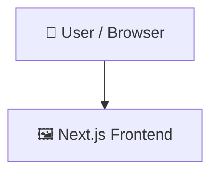

# fusion

> A real-time team collaboration platform built with Next.js and Convex.

   

## 📑 Table of Contents

- [Description](#description)
- [Key Features](#key-features)
- [Use Cases](#use-cases)
- [Tech Stack](#tech-stack)
- [Architecture](#architecture)
- [Quick Start](#quick-start)
- [Key Dependencies](#key-dependencies)
- [Available Scripts](#available-scripts)
- [Project Structure](#project-structure)
- [Development Setup](#development-setup)
- [Contributors](#contributors)
- [Contributing](#contributing)

## 📝 Description

Fusion is a full-stack collaborative platform designed to streamline workspace management and real-time team communication. Built as a Next.js web application, it addresses the challenge of coordinating project workspaces and internal channels under a unified, responsive interface. The application automatically detects available workspaces and routes users seamlessly, providing a cohesive entry point for team operations.

## ✨ Key Features

- **🏢 Dynamic Workspace Routing** — Automatically retrieves user workspaces and handles redirection to active environments upon initial client-side load.
- **💬 Channel-Based Communication** — Enables teams to structure their communication using dedicated modals to create and manage channels.
- **⚡ Convex Live Queries** — Utilizes a serverless Convex backend to implement real-time queries and mutations that instantly synchronize client state.
- **🔐 Next.js Server-Side Authentication** — Secures data access and application routing using Convex's Next.js Server Auth Provider integration.
- **🔀 State and URL Management** — Manages UI state seamlessly by combining Jotai atoms with Nuqs adapters for URL query parameters.

## 🎯 Use Cases

- Setting up a private, real-time workspace hub for distributed teams to organize discussions into channels.
- Developing a secure, serverless messaging application that requires live state updates and instant database synchronization.
- Creating multi-tenant collaboration dashboards with built-in user routing and workspace creation capabilities.

## 🛠️ Tech Stack

  

**Notable libraries:** Jotai, NextAuth, React Hook Form, Zod

## 🏗️ Architecture

A high-level view of how the main pieces fit together:



## ⚡ Quick Start

```bash

# 1. Clone the repository
git clone https://github.com/ni3420/fusion.git

# 2. Install dependencies
npm install

# 3. Start the dev server
npm run dev
```

## 📦 Key Dependencies

```
@auth/core: 0.41.1
@convex-dev/auth: ^0.0.94
@hookform/resolvers: ^5.4.0
@tiptap/extension-placeholder: ^3.27.1
@tiptap/pm: ^3.27.0
@tiptap/react: ^3.27.0
@tiptap/starter-kit: ^3.27.0
class-variance-authority: ^0.7.1
clsx: ^2.1.1
cmdk: ^1.1.1
convex: ^1.41.0
date-fns: ^4.4.0
emoji-picker-react: ^4.19.1
jotai: ^2.20.1
lucide-react: ^1.18.0
```

## 🚀 Available Scripts

- **dev** — `npm run dev`
- **build** — `npm run build`
- **start** — `npm run start`
- **lint** — `npm run lint`

## 📁 Project Structure

```
.
├── AGENTS.md
├── CLAUDE.md
├── bun.lock
├── components.json
├── convex
│   ├── _generated
│   │   ├── api.d.ts
│   │   ├── api.js
│   │   ├── dataModel.d.ts
│   │   ├── server.d.ts
│   │   └── server.js
│   ├── auth.config.ts
│   ├── auth.ts
│   ├── channels.ts
│   ├── comments.ts
│   ├── conversations.ts
│   ├── http.ts
│   ├── members.ts
│   ├── messages.ts
│   ├── reactions.ts
│   ├── schema.ts
│   ├── thread.ts
│   ├── upload.ts
│   ├── users.ts
│   └── workspaces.ts
├── eslint.config.mjs
├── next.config.ts
├── package.json
├── postcss.config.mjs
├── public
│   ├── file.svg
│   ├── globe.svg
│   ├── next.svg
│   ├── vercel.svg
│   └── window.svg
├── sampleData.jsonl
├── src
│   ├── app
│   │   ├── auth
│   │   │   └── page.tsx
│   │   ├── favicon.ico
│   │   ├── globals.css
│   │   ├── join
│   │   │   └── [workspaceId]
│   │   │       └── page.tsx
│   │   ├── layout.tsx
│   │   ├── page.tsx
│   │   └── workspaces
│   │       └── [workspaceId]
│   │           ├── channels
│   │           │   └── ...
│   │           ├── layout.tsx
│   │           ├── member
│   │           │   └── ...
│   │           └── page.tsx
│   ├── components
│   │   ├── editor.tsx
│   │   ├── hint.tsx
│   │   └── ui
│   │       ├── avatar.tsx
│   │       ├── button.tsx
│   │       ├── card.tsx
│   │       ├── command.tsx
│   │       ├── dialog.tsx
│   │       ├── direction.tsx
│   │       ├── dropdown-menu.tsx
│   │       ├── hover-card.tsx
│   │       ├── input-group.tsx
│   │       ├── input.tsx
│   │       ├── label.tsx
│   │       ├── popover.tsx
│   │       ├── resizable.tsx
│   │       ├── sheet.tsx
│   │       ├── skeleton.tsx
│   │       ├── sonner.tsx
│   │       ├── switch.tsx
│   │       ├── textarea.tsx
│   │       └── tooltip.tsx
│   ├── features
│   │   ├── auth
│   │   │   ├── api
│   │   │   │   └── use-current-user.ts
│   │   │   ├── components
│   │   │   │   ├── LoginCard.tsx
│   │   │   │   ├── RegisterCard.tsx
│   │   │   │   ├── authPage.tsx
│   │   │   │   └── user-button.tsx
│   │   │   └── types.ts
│   │   ├── channels
│   │   │   ├── api
│   │   │   │   ├── use-create-channels.ts
│   │   │   │   ├── use-delete-channel.ts
│   │   │   │   ├── use-get-channels.ts
│   │   │   │   ├── use-getchannel-Info.ts
│   │   │   │   └── use-rename-channel.ts
│   │   │   ├── components
│   │   │   │   ├── channel-header.tsx
│   │   │   │   ├── channel-preference-model.tsx
│   │   │   │   ├── channel-topbar.tsx
│   │   │   │   └── create-channel-model.tsx
│   │   │   └── hooks
│   │   │       └── use-create-model.ts
│   │   ├── conversations
│   │   │   ├── api
│   │   │   │   └── use-create-or-get-conversation.ts
│   │   │   └── hook
│   │   │       └── use-get-coversation-id.ts
│   │   ├── members
│   │   │   ├── api
│   │   │   │   ├── use-current-memebr.ts
│   │   │   │   ├── use-get-memberById.ts
│   │   │   │   └── use-get-members.ts
│   │   │   └── components
│   │   │       └── chat.tsx
│   │   ├── messages
│   │   │   ├── api
│   │   │   │   ├── use-create-message.ts
│   │   │   │   ├── use-get-messageById.ts
│   │   │   │   ├── use-get-messages.ts
│   │   │   │   ├── use-remove-message.ts
│   │   │   │   ├── use-update-message.ts
│   │   │   │   └── use-upload.ts
│   │   │   ├── components
│   │   │   │   ├── message-feed.tsx
│   │   │   │   ├── message-list.tsx
│   │   │   │   └── message-toolbar.tsx
│   │   │   ├── hooks
│   │   │   │   └── use-panel.ts
│   │   │   ├── store
│   │   │   │   └── use-parent-msg.ts
│   │   │   └── types.ts
│   │   ├── reactions
│   │   │   ├── api
│   │   │   │   └── use-toggle-reaction.ts
│   │   │   └── components
│   │   │       └── reaction.tsx
│   │   ├── thread
│   │   │   ├── api
│   │   │   │   ├── use-create-thread-reply.ts
│   │   │   │   └── use-get-thread-replies.ts
│   │   │   └── components
│   │   │       ├── thread-model.tsx
│   │   │       └── thread-panel.tsx
│   │   ├── upload
│   │   │   ├── api
│   │   │   │   ├── use-generate-url.ts
│   │   │   │   ├── use-get-upload-image.ts
│   │   │   │   └── use-update-image.ts
│   │   │   ├── components
│   │   │   │   └── Show-Image.tsx
│   │   │   └── hook
│   │   │       └── use-get-stroageId.ts
│   │   └── workspaces
│   │       ├── api
│   │       │   ├── use-create-workspace.ts
│   │       │   ├── use-get-workpspaces.ts
│   │       │   ├── use-get-workspaceById.ts
│   │       │   ├── use-join.ts
│   │       │   ├── use-remove-workspace.ts
│   │       │   ├── use-upadte-workpspace.ts
│   │       │   └── use-workspace-info.ts
│   │       ├── components
│   │       │   ├── Preference-model.tsx
│   │       │   ├── confirm.tsx
│   │       │   ├── create-workspace-model.tsx
│   │       │   ├── sidebar-items.tsx
│   │       │   ├── sidebar.tsx
│   │       │   ├── toolbar.tsx
│   │       │   ├── workspace-header.tsx
│   │       │   ├── workspace-invite-card.tsx
│   │       │   ├── workspace-section.tsx
│   │       │   ├── workspace-sidebar.tsx
│   │       │   └── workspace-switcher.tsx
│   │       └── hooks
│   │           ├── use-confirm.ts
│   │           ├── use-mobile-sidebar.ts
│   │           ├── use-reset-code.ts
│   │           └── use-workspace-id.ts
│   ├── lib
│   │   └── utils.ts
│   ├── middleware.ts
│   ├── providers
│   │   └── convex-client-provider.tsx
│   └── store
│       └── use-workspace-model.ts
└── tsconfig.json
```

## 🛠️ Development Setup

### Node.js / JavaScript
1. Install Node.js (v18+ recommended)
2. Install dependencies: `npm install` (or `yarn` / `pnpm install` / `bun install`)
3. Start the dev server: see the **Quick Start** above

## 👥 Contributors

Thanks to everyone who has contributed to this project:

<p align="left">
<a href="https://github.com/ni3420" title="ni3420"></a>
</p>

[See the full list of contributors →](https://github.com/ni3420/fusion/graphs/contributors)

## 👥 Contributing

Contributions are welcome! Here's the standard flow:

1. **Fork** the repository
2. **Clone** your fork: `git clone https://github.com/ni3420/fusion.git`
3. **Branch**: `git checkout -b feature/your-feature`
4. **Commit**: `git commit -m 'feat: add some feature'`
5. **Push**: `git push origin feature/your-feature`
6. **Open** a pull request

Please follow the existing code style and include tests for new behavior where applicable.

---

<div align="center">

[](https://readmebuddy.com)

<sub>Generate beautiful READMEs in seconds → <a href="https://readmebuddy.com">readmebuddy.com</a></sub>

</div>
This is a [Next.js](https://nextjs.org) project bootstrapped with [`create-next-app`](https://nextjs.org/docs/app/api-reference/cli/create-next-app).

reconnect the files

## Getting Started

First, run the development server:

```bash
npm run dev
# or
yarn dev
# or
pnpm dev
# or
bun dev
```

Open [http://localhost:3000](http://localhost:3000) with your browser to see the result.

You can start editing the page by modifying `app/page.tsx`. The page auto-updates as you edit the file.

This project uses [`next/font`](https://nextjs.org/docs/app/building-your-application/optimizing/fonts) to automatically optimize and load [Geist](https://vercel.com/font), a new font family for Vercel.

## Learn More

To learn more about Next.js, take a look at the following resources:

- [Next.js Documentation](https://nextjs.org/docs) - learn about Next.js features and API.
- [Learn Next.js](https://nextjs.org/learn) - an interactive Next.js tutorial.

You can check out [the Next.js GitHub repository](https://github.com/vercel/next.js) - your feedback and contributions are welcome!

## Deploy on Vercel

The easiest way to deploy your Next.js app is to use the [Vercel Platform](https://vercel.com/new?utm_medium=default-template&filter=next.js&utm_source=create-next-app&utm_campaign=create-next-app-readme) from the creators of Next.js.

Check out our [Next.js deployment documentation](https://nextjs.org/docs/app/building-your-application/deploying) for more details.
